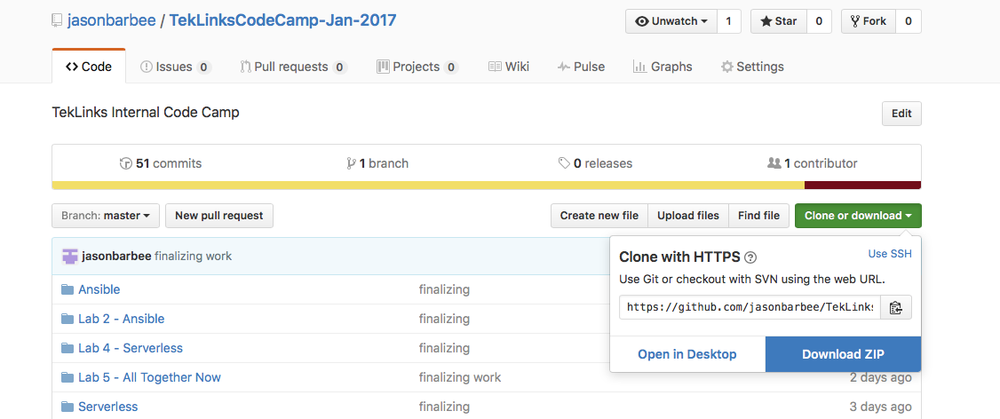

footer: TekLinks Code Camp
slidenumbers: true
autoscale: true


# Code Camp
## Ansible Introduction


Jason Barbee
Solutions Architect
CCIE #18039

---
Agenda
==

1. Install VirtualBox and Vagrant
1. Launch Vagrant Box
1. Install VS Code and Postman

---
# Download Code Repository
https://github.com/jasonbarbee/TekLinksCodeCamp-Jan-2017 


---
# Virtual and Vagrant
* Download Vagrant and install - https://www.vagrantup.com/downloads.html
* Download Virtualbox and install https://www.virtualbox.org/wiki/Downloads
* Visual Studio Code https://code.visualstudio.com/download

----
Launch Code Camp Virtualbox Installer
* Unzip the Github Repo
* Open a shell and cd to the ```vagrant-code-camp``` folder
* Issue command ```vagrant up```. give it 10-20 minutes. 
* When done ```vagrant ssh``` to get inside the VM. 

---
# Vagrant Usage

```Vagrant ssh`` - connects to your VM Shell
```Vagrant down``` - shutdown the virtualbox
```Vagrant destroy``` - removes the virtual machine

---
# Vagrant Shared folder
Vagrant maps a shared folder within the VM you can access /vagrant to access the "vagrant-code-camp" folder

---
# Setup VS Code ( Optional )
Install a few extensions
Within VS Code choose "View -> Extensions" or click the Extensions icon on the left tree.
Some recommendations
* vscode-icons
* ESHint or jshunt
* Code Spellchecker
* beautify

