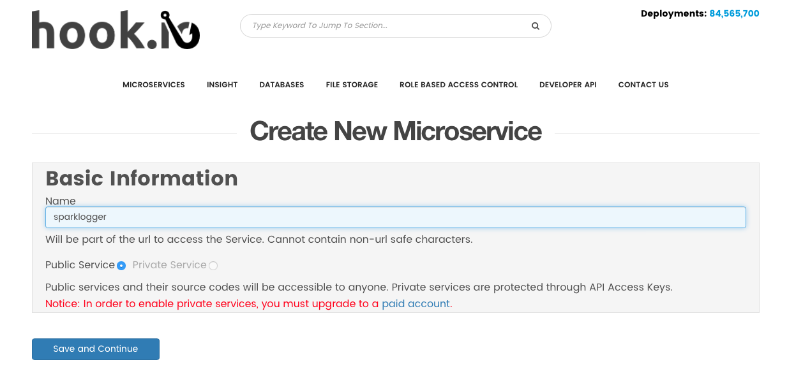
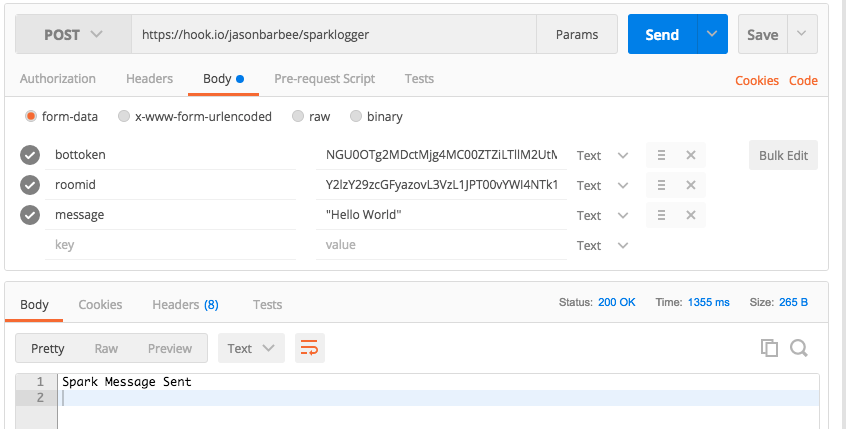
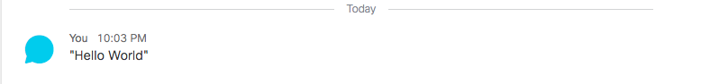
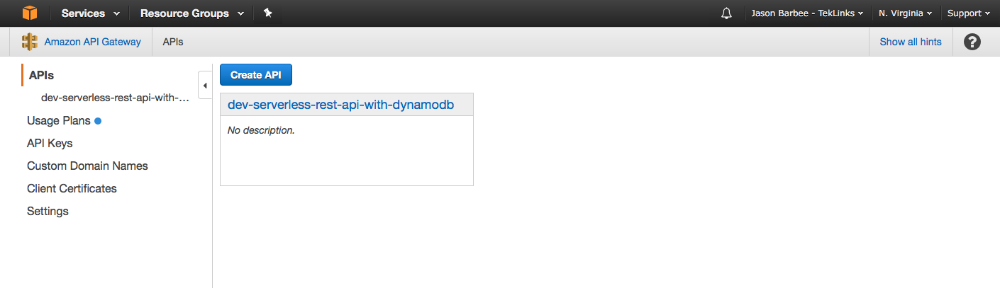
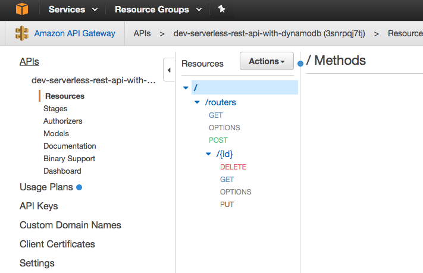
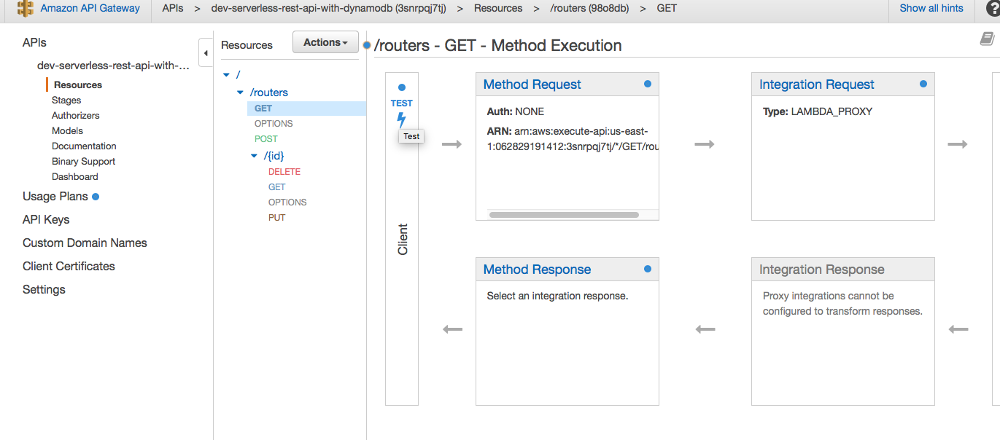
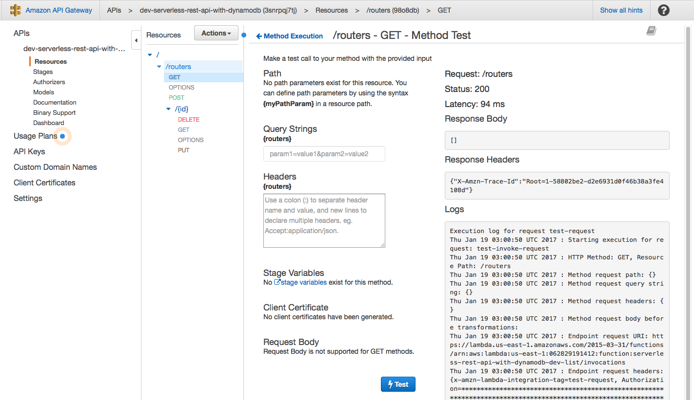
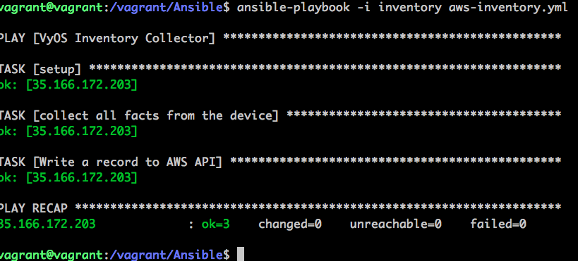
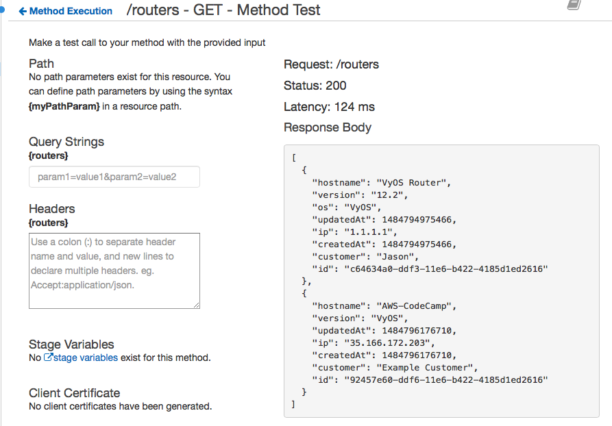

footer: TekLinks Code Camp
slidenumbers: true
autoscale: true


# Code Camp
## Lab 4 - Serverless Platforms
Jason Barbee
Solutions Architect
CCIE #18039

---
Agenda
==

1. Sign up for Hook.io
1. Build a simple Hook.io endpoint
    1. This task will send an API call to a Spark Room
1. AWS
    1. Sign up for AWS
    1. Install our example API
    1. Test POST
    1. Test GET
    1. Remove the API

---
# Simple Microservices @ Hook.io

Create a Hook.io Account
Make a function as a service process to call our Spark Logger.

---
--
# Sign up for an account at Hook.io
Hook.io will give you a very simple click to start web hook service.

---
# Add a new service at Hook.io
Click Create MicroService at the top navigation bar. - Call it **sparklogger**




---
# Copy Spark Logging Code
Copy ```sparklogger.js``` (in the Lab 4 Serverless Folder)
Paste/Save the content into a new hook at Hook.io called "sparklogger")
Your Hook.io URL will be like this

https://hook.io/yourUserName/sparklogger

It requires these parameters

* bottoken - your authentication bot/person tokens
* roomid - the roomID in Spark that you want to post into.
* message - the content you want to post

---
# Spark Logger Code
```javascript
module['exports'] = function simpleHttpRequest (hook) {
  // npm modules available, see: http://hook.io/modules
    var request = require('request');
	var botToken= hook.params.bottoken;
  	var roomId= hook.params.roomid;
  	var text= hook.params.message;
  	var body={"roomId": roomId , "text": text};
    var postReq = {
            url: "https://api.ciscospark.com/v1/messages",
            method: "POST",
            headers: {
                    'Accepts': 'application/json',
                    'Content-type': 'application/json',
                    'Authorization': "Bearer " + botToken
                    },
      		json: body,
            };
	
    request.post(postReq,function(err, res, body){
  
    if (err) {
      console.log("Error", err.message);
      return hook.res.end(err.message);
    }
      //Check for right status code
    if(res.statusCode !== 200){
        console.log('Invalid Status Code Returned:', res.statusCode);
      return hook.res.end("Spark API Error " + res.statusCode);
    }

    //All is good. Print the body
      return hook.res.end("Spark Message Sent");
    });

};
```

---
# Test it in Postman
Now if you call your URL 
https://hook.io/jasonbarbee/sparklogger
with parameters bottoken, roomid, message
it should post our message...


---
# Making a useful API
Let's make an API that creates,updates,deletes a router inventory.
We will use AWS API Gateway, AWS DynamoDB, AWS Simple Notification Services (SNS) and AWS Lambda.

And some Serverless Framework Magic.

---
# Setup an account for Serverless to use your AWS

Create or login to your Amazon Web Services Account and go to the Identity & Access Management (IAM) page.

Click on Users and then Create New Users. Enter a name in the first field to remind you this User is the Framework, like serverless-admin. Then click Create. Later, you can create different IAM Users for different apps and different stages of those apps. That is, if you don't use separate AWS accounts for stages/apps, which is most common.

View and copy the API Key & Secret to a temporary place. You'll need it in the next step.

In the User record in the AWS IAM Dashboard, look for Managed Policies on the Permissions tab and click Attach Policy.

In the next screen, search for and select AdministratorAccess then click Attach.

---
# Vagrant Check
This lab is designed to be run inside the Vagrant profile provided in the Code Camp Repo.
Make sure you have 
CD to the vagrant-code-camp folder and run
"vagrant ssh" to access the Vagrant VM.
This Lab 4 is designed to run inside the Serverless Folder within the Vagrant Folder.

---
# Give Severless AWS Access
Replace the keys below with your own.

```
serverless config credentials --provider aws --key myawesomekey --secret myawesomesecret
```

---
# Let's deploy our prebuilt API
Change Directory to Serverless example

Code Camp Repo / Vagrant/Serverless

**This next step will load the depedancy packages to the folder. If you don't do this step it will fail.**

```
npm install
```

```
serverless deploy
```

---
# Deployed!
This also shows you your REST endpoint URLs!


---
# Open the API in your AWS Console
## Make sure to choose "N. Virginia" on the top right of AWS console!
Select Amazon API Gateway service.
You should see our new service 
"dev-serverless-rest-api-with-dynamodb"

---
# API Gateway Screenshot


---
# API Methods 


---
# Test our API
Click GET and click "TEST"


---
# Test GET Results
Top Right Status 200 is good. Right now there are no results in the right box. It's just a blank JSON object {}
We also get a stack trace of the console logs that happened during the method.


---
# POST a Router manually
Use the POST/ method - click TEST, and use this as a template the body

```json
{
    "customer" : "Jason",
    "ip" : "1.1.1.1",
    "os" : "VyOS",
    "hostname": "VyOS Router",
    "version": "12.2",
    "securitycheck": "false"
}
```

You should get Status 200 (OK) - that means it posted correctly to the database.

---
# Let's post some real data to the API

Your GET request will return all the routers in the inventory.
Let's add a router to the database using Ansible.

---
# Build an Ansible Playbook
You can use the file  "aws-inventory.yml" under the Vagrant/Ansible folder.
We use a built in Ansible module called URI to POST data to a URL after collecting the inventory.
**make sure to change this line in aws-inventory.yml**
url: "https://3snrpqj7tj.execute-api.us-east-1.amazonaws.com/dev/routers"
to **YOUR URL** reported by Serverless so that the data gets posted to YOUR API (not mine)

---
# Ansible AWS Tasks - Example

```yaml
  tasks:
    - name: collect all facts from the device
      vyos_facts:
        gather_subset: all
        provider: "{{ cli }}"
      register: result

    - name: Write a record to AWS API 
      uri:
        url: "https://3snrpqj7tj.execute-api.us-east-1.amazonaws.com/dev/routers"
        method: POST
        HEADER_Content-Type: application/json
        body: '{ 
            "ip" : "{{ inventory_hostname }}", 
            "version" : "{{ result.ansible_facts.ansible_net_version }}", 
            "hostname" : "{{ result.ansible_facts.ansible_net_hostname  }}", 
            "customer" : "{{ customername }}",
            "securitycheck" : "false"
            }'
        body_format: json
        validate_certs: no
```

---
# Run Ansible AWS inventory
ansible-playbook -i inventory aws-inventory.yml


---
# Query our API/database
On the right we see both entries, our custom posted entry, and the Ansible entry.

Caution if you run Ansible more than once, it will upload duplicates. 
If you feel like rewriting some code to prevent that - go for it.

---
# End of Lab 4
## Thanks!