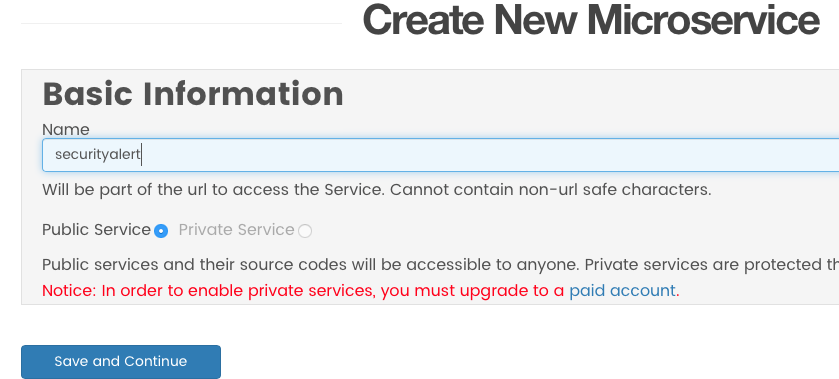

footer: TekLinks Code Camp
slidenumbers: true
autoscale: true


# Code Camp
## Lab 5 - All Together Now
Jason Barbee
Solutions Architect
CCIE #18039

---
Agenda
==

1. Add a Hook.io that will:
  1. Send data to Spark
  1. Send a call request to Tropo
1. Ansible
    1. Create check for VyOS
    1. Create Trigger for VyOS detection task
    1. Test our Security policy trigger.

---
# Goal
Trigger a condition task in Playbook
If the device detected is a VyOS / Vyatta - then trigger a web task at hook.io
The web task will alert user via Spark, and call the user via Tropo and announce the finding.

---
# Sign up for an account at Hook.io
Hook.io will give you a very simple click to start web hook service.

---
# Add a new service at Hook.io
Click Create MicroService at the top navigation bar.

# Make sure to call it ```securityalert```

---
# Copy Tropo and Spark Logging Code
Copy ```securityalert.js``` (in the Lab 5 All Together Now Folder)
Paste/Save the content into a new hook at Hook.io called "securityalert")
Your Hook.io URL for should looke like this

https://hook.io/jasonbarbee/securityalert

It requires these parameters

* bottoken - your authentication bot/person tokens
* roomid - the roomID in Spark that you want to post into.
* message - the content you want to post
* customername - a customer name - just use your own name
* numbertocall - a phone number to dial

---
# Update your inventory keys and Phone Number
Update your Ansible inventory file with your tokens

```yaml
[AWS-Routers]
35.166.172.203

[AWS-Routers:vars]
username="codecamp"
password="bettertogether"

[all:vars]
hookname="yourusername"
bottoken="yourSparkUserAuthenticationToken"
roomid="Y2lzY29zcGFyazovL3VzL1JPT00vYWI4NTk1YjAtY2M3NC0xMWU2LWJkMjUtZDU5Y2U3ZjUxOTE5"
numbertocall="yourcell"
customername="Example Customer"
```
Do not change the Roomid. The roomid key already points to the TekLinks Spark Code Camp Room.

---
# Ansible - Call a conditional Task
### We will use include/when to match conditions in Ansible.
```yaml
    - name: collect all facts from the device
      vyos_facts:
        gather_subset: all
        provider: "{{ cli }}"
      register: result

    - name: debug stuff
      debug:
        var: result.ansible_facts

    - include: security-alert.yml
      when: result.ansible_facts.ansible_net_version == "VyOS"
```
---
# Conditional Tasks
* security-alert.yml contents will be included ONLY when the facts show that the device is a VyOS model

* We registered the results to a variable called result, then checked a field in the result if it contained VyOS.

* The include statement just includes the file if that is true, as if we had typed the contents of security-alert.yml into the parent file.

---
# Security Alert Task
```yaml
---
    - name: Security Alert
      shell: echo "SECURITY ALERT!"

    - name: Alert the NOC Team
      uri:
        url: "https://hook.io/{{ hookname }}/securityalert"
        method: POST
        HEADER_Content-Type: application/json
        body: '{ 
          "bottoken" : "{{ bottoken }}", 
          "hookname" : "{{ hookname }}", 
          "ip" : "{{ inventory_hostname }}", 
          "version" : "{{ result.ansible_facts.ansible_net_version }}", 
          "hostname" : "{{ result.ansible_facts.ansible_net_hostname  }}", 
          "roomid" : "{{ roomid }}", 
          "numbertocall" : "{{ numbertocall }}", 
          "customername" : "{{ customername }}"
          }'
        body_format: json
        validate_certs: no
```
---
# Run Ansible and see if it works!

```ansible-playbook -i inventory security-test.yml```
You should get a Spark message in the Code Camp Room
And if you entered your Phone number, a phone call from Tropo announcing this message.


---
# End of Lab
## Thanks!