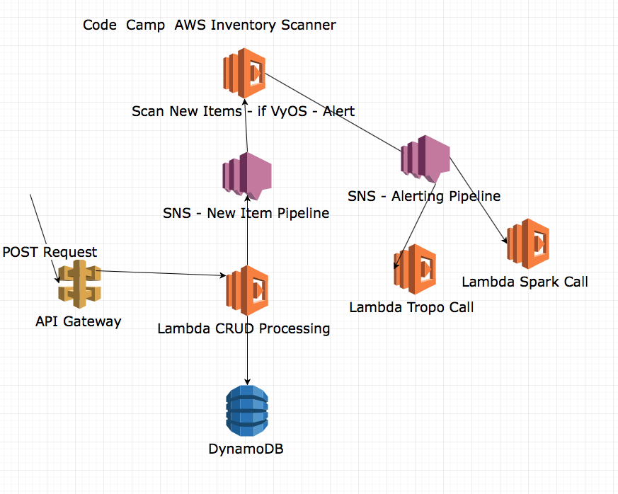

footer: TekLinks Code Camp
slidenumbers: true
autoscale: true


# Code Camp
## Lab 5 - All Together Now
Jason Barbee
Solutions Architect
CCIE #18039

---
# Section 1 - Micro-Service 101

1. Add a Hook.io that will:
  1. Send data to Spark
  1. Send a call request to Tropo
1. Ansible
    1. Create check for VyOS
    1. Create Trigger for VyOS detection task
    1. Test our Security policy trigger.

---
# Goal
Trigger a condition task in Playbook
If the device detected is a VyOS / Vyatta - then trigger a web task at hook.io
The web task will alert user via Spark, and call the user via Tropo and announce the finding.

---
# Sign up for an account at Hook.io
Hook.io will give you a very simple click to start web hook service.

---
# Add a new service at Hook.io
Click Create MicroService at the top navigation bar.

# Make sure to call it ```securityalert```

---
# Copy Tropo and Spark Logging Code
Copy ```securityalert.js``` (in the Lab 5 All Together Now Folder)
Paste/Save the content into a new hook at Hook.io called "securityalert")
Your Hook.io URL for should looke like this

https://hook.io/jasonbarbee/securityalert

It requires these parameters

* bottoken - your authentication bot/person tokens
* roomid - the roomID in Spark that you want to post into.
* message - the content you want to post
* customername - a customer name - just use your own name
* numbertocall - a phone number to dial

---
# Update your inventory keys and Phone Number
**Update your Ansible inventory file with YOUR tokens**

```yaml
[AWS-Routers]
35.166.172.203

[AWS-Routers:vars]
username="codecamp"
password="bettertogether"

[all:vars]
hookname="yourusername"
bottoken="yourSparkUserAuthenticationToken"
roomid="Y2lzY29zcGFyazovL3VzL1JPT00vYWI4NTk1YjAtY2M3NC0xMWU2LWJkMjUtZDU5Y2U3ZjUxOTE5"
numbertocall="yourcell"
customername="Example Customer"
```
The roomid key already points to the TekLinks Spark Code Camp Room, you can change it to your own room key.

---
# Ansible - Call a conditional Task - Reference
### We will use include/when to match conditions in Ansible.
### This is reference only, the code is ready for you to run as aws-scan.yml

```yaml
    - name: collect all facts from the device
      vyos_facts:
        gather_subset: all
        provider: "{{ cli }}"
      register: result

    - name: debug stuff
      debug:
        var: result.ansible_facts

    - include: security-alert.yml
      when: result.ansible_facts.ansible_net_version == "VyOS"
```
---
# Reference - Conditional Tasks
* security-alert.yml contents will be included ONLY when the facts show that the device is a VyOS model

* We registered the results to a variable called result, then checked a field in the result if it contained VyOS.

* The include statement just includes the file if that is true, as if we had typed the contents of security-alert.yml into the parent file.

---
# Reference - Security Alert Task

```yaml
---
    - name: Security Alert
      shell: echo "SECURITY ALERT!"

    - name: Alert the NOC Team
      uri:
        url: "https://hook.io/{{ hookname }}/securityalert"
        method: POST
        HEADER_Content-Type: application/json
        body: '{ 
          "bottoken" : "{{ bottoken }}", 
          "hookname" : "{{ hookname }}", 
          "ip" : "{{ inventory_hostname }}", 
          "version" : "{{ result.ansible_facts.ansible_net_version }}", 
          "hostname" : "{{ result.ansible_facts.ansible_net_hostname  }}", 
          "roomid" : "{{ roomid }}", 
          "numbertocall" : "{{ numbertocall }}", 
          "customername" : "{{ customername }}"
          }'
        body_format: json
        validate_certs: no
```
---
# Run Ansible and see if it works!

```ansible-playbook -i inventory vyos-scan.yml```

You should get a Spark message in the Code Camp Room
And if you entered your Phone number, a phone call from Tropo announcing this message.


---
# Section 2 - AWS Only
 We're about to go all in on AWS now.
 We will not use Hook.io here.
 All the code we need has already been uploaded to Amazon.
 All the resources have been provisioned using AWS Cloud Formation and the Serverless.yml file

---
# AWS Infrastructure Layout


---
# AWS
Look over the code in the Serverless files.

---
# AWS Walkthrough


---
# Ansible command to kick off the magic

```ansible-playbook -i inventory aws-scan.yml```
* Make sure your inventory file contains your credentials.

---
# Actions
1. Ansible scans the network
  1. Ansible found a Vyatta Routers
  1. Ansible triggered a POST to AWS API.
2. AWS wrote to the database.
  1. AWS Lambda put a message on the newitem SNS
  1. Newitem SNS triggered a Lambda securityscan function
(cont'd)
---
# Actions 2
  1. NewItem SNS triggered SecurityScan lambda
  1. SecurityScan detected VyOS and pushed a new SNS message to SNS queue securityalert
  2. SecurityAlert sent a SNS message to securityalert
  2. The SNS on securityalert triggered our Spark and Tropo Lambda functions


---
# End of Lab
## Thanks!