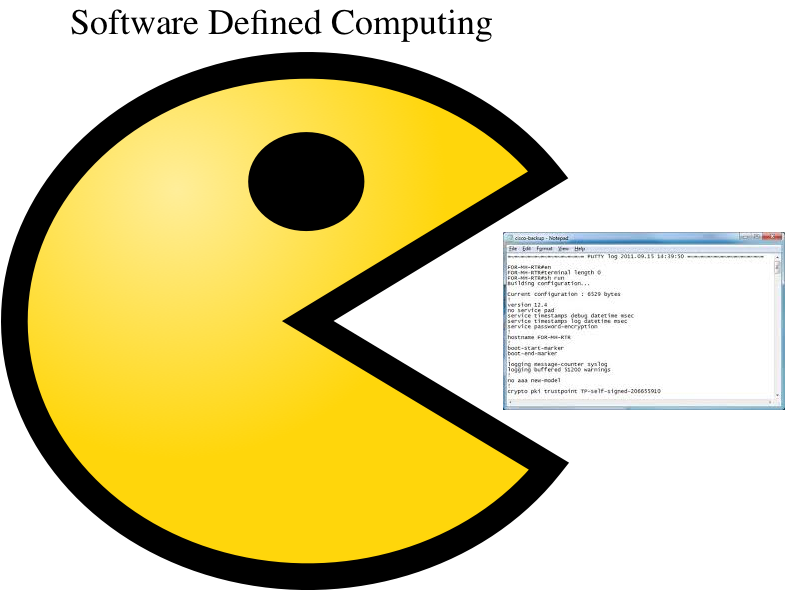
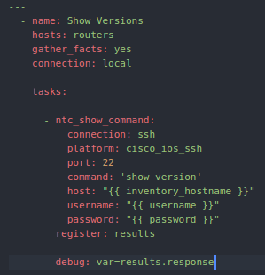
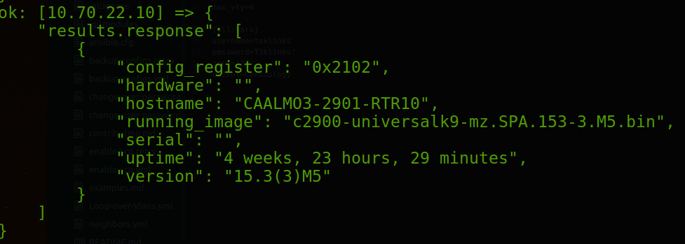
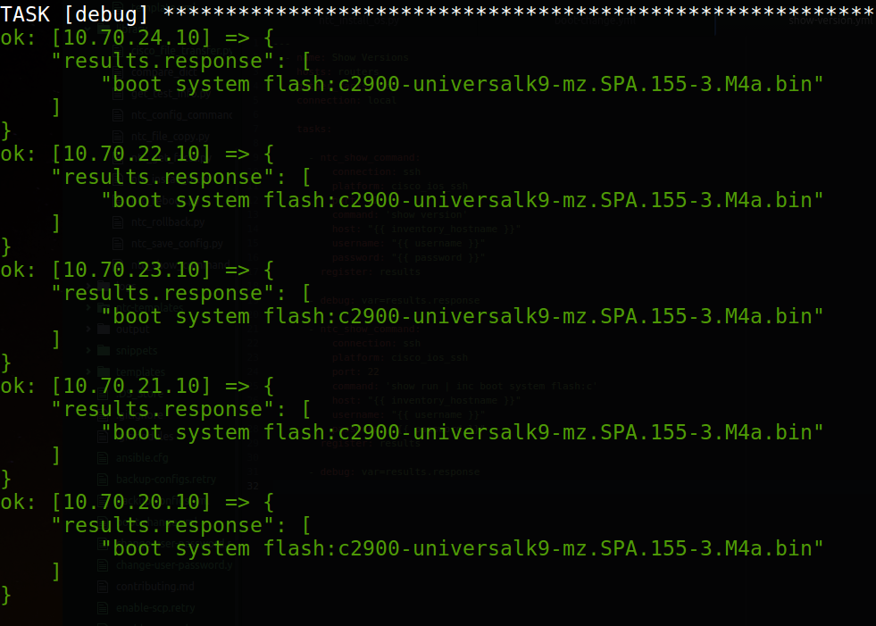

footer: TekLinks Code Camp
slidenumbers: true
autoscale: true


# Code Camp
## Ansible Introduction


Jason Barbee
Solutions Architect
CCIE #18039

---
Agenda
==

1. APIs and CLIs
1. Ansible Intro
1. Use Cases
1. Installing Ansible
1. Using Ansible

---
# APIS and CLIs

---
# Device Provision Time
Servers - Instant, full automation possible.
Network - Create vlans, interfaces, routing, manual. _SLOW._

Traditional Networking **CANNOT** keep up with the pace of today's technology.
* But we can't replace it all overnight.

---
# Network Device Programmability

- Wait - did you mean SDN? 
- Is that Cisco ACI? ... NSX maybe? 


---
# SDN requires networking to be automated


---

# A tale of two worlds
## IOS CLI telnet / SSH
* Huge install base. 
* Will be around for for many years to come.

---

# Cisco Networking APIs
* APIC-EM - REST controller for IOS Routers
* ACI - API controller for true SDN networking
* DNA/Panda/Yang - ISR4ks, 3850 Switches (Denali)
* NX-OS - REST API built into Nexus OS.
* Meraki - Cloud Controlled API controller

---

# Network Automation is the future
### It's OK to use telnet/ssh tooling while we cross that bridge[^1].


[^1]: But sometimes feels like this!

---
Agenda
==

1. APIs and CLIs
1. **Ansible Intro**
1. Use Cases
1. Installing Ansible
1. Using Ansible

---
# Ansible Intro

- Automate all the 'things'
- Open Source project. Free.
- Red Hat backed - "Ansible Tower" - Commercial addon for Ansible.
<br>


### "SOLVE IT. AUTOMATE IT. SHARE IT."

---
# Sounds Complicated. Who needs this anyway... 

250,000+ downloads per **month**.
2200 contributors to the project
750+ modules/plugins
100+ modules for Amazon
Modules for every major networking manufacturer.

---
# But... what does it do for me?
> "Ansible is a radically simple IT automation engine that automates cloud provisioning, configuration management, application deployment, intra-service orchestration, and many other IT needs."
-- Ansible.com

---
# Even Cisco is in this game
> "The work the Ansible team is doing… is something the entire industry should be paying attention to."
--Lew Tucker, VP & CTO, Cloud Computing, Cisco

---
# What about Chef/Puppet/other tool?

Ansible is agent-less.
Many other tools require a bootstrap agent on the destination machine.


---
# What can Ansible do for Network Engineers?

1. Template IOS Configurations -	HSRP, Vlans, ACLs
2. Standardize commands accross wide inventory
2. Reset security or passwords 
2. Audit configurations
3. Backup Configurations on schedule or before/after changes.
4. Per-host Ping tests -  Network Testing
4. Trigger API calls 
5. Network Assessments/Inventory

---
# What can Ansible do for Storage and Virtualization Guys?

1. Build servers automatically in Vmware or Cloud
	1. more than 100 AWS modules built in
	2. Vmware, OpenStack, etc
2. Automate installation packages
	1. Support for Windows, Linux, etc 	
3. Per host status checks or ping testing
	1. 	Deeper testing
4. Inventory data of all your servers

---
Agenda
==

1. APIs and CLIs
1. Ansible Intro
1. **Use Cases**
1. Installing Ansible
1. Using Ansible

---

# Real world stuff
* Security Audit Remediation
  * Update the IOS
  * Disable telnet, generate keys, turn on SSH, disable http, ssh version 2... 
  * ACL standardization

---

# Traditional way - Copy and Paste
### Fix one device, get your "plan" of commands and action, repeat.


---
# Or maybe there's a better way 

---
Agenda
==

1. APIs and CLIs
1. Ansible Intro
1. Use Cases
1. **Installing Ansible**
1. Using Ansible


---
# Install Ansible - Windows
Download "Babun" as a Cygwin Shell - http://babun.github.io/

```bash
Loads Everything you need - copy/paste

curl -s https://raw.githubusercontent.com/tiangolo/ansible-babun-bootstrap/master/install.sh | source /dev/stdin

pact install python-yaml
pact install python-setuptools python-ming
pact install libxml2-devel libxslt-devel libyaml-devel
curl -skS https://bootstrap.pypa.io/get-pip.py | python
pip install virtualenv
curl -skS https://raw.githubusercontent.com/mitsuhiko/pipsi/master/get-pipsi.py | python
pip install napalm

If you get errors running Ansible later-
you might have to exit and "rebaseall" - run this if you get errors about child processes
cmd /c %SYSTEMDRIVE%\Users\%USERNAME%\.babun\cygwin\bin\dash.exe -c '/usr/bin/rebaseall -v'
then Babun again
```

---
# Install Continued
Ubuntu 

```bash
sudo apt-get install ansible
```

Fedora

```bash
yum install ansible
```

Mac

```bash 
xcode-select --install
easy_install --user pip
```
---
# Install PIP Libraries
Jinja2
MarkupSafe
jtextfsm
requests
psutil
python-slugify
ciscoconfparse
netmiko
lxml
napalm
ntc-ansible
pyntc

---
# Ok you lost me. That is way too much work.

---
# Vagrant & Ansible

Let's make some instant ~~Cof...~~ Ansible
<br>


- Vagrant launches a VM, then installs Ansible
- Instant Ansible/Python Dev Box anytime, with virtualbox and Ansible. 


---
# How do I use it?
Vagrant installed Ubuntu, all the requirements and you can use it.
```
Vagrant up
``` - installs and provisions.
```
Vagrant ssh
``` - connects to your VM Shell

It mapped a shared folder within the VM - /vagrant
so within your Vagrant VM - any edits you make to your Ansible folder are mapped

---
Agenda
==

1. APIs and CLIs
1. Ansible Intro
1. Use Cases
1. **Using Ansible**

---
^ It's not a newly discovered creature... Before we tell ansible....
# YAML Syntax
Inventory files and Tasks use YAML Syntax
Syntax looks like this-

```yaml
---
# A list of tasty fruits
fruits:
    - Apple
    - Orange
    - Strawberry
    - Mango
```


---
# Inventory - Simple Example
- Group Name
- Hostname (variable=value)

```yaml
[routers]
192.168.1.1
```
---
# Inventory - Group Variables
```yaml
[all:vars]
domain=mydomain.org
admin_user=admin
admin_password=secretsauce
enable_password=secretsauce
netmask=255.255.255.0
gateway=192.168.1.1
name_server1=8.8.8.8

[ROUTERS:vars]
interface=gi0/0

[ROUTERS]
Router1 ipaddress=192.168.1.2
```

--- 
# Template Files - Jinja2
```jinja
enable secret {{enable_password}}
hostname {{inventory_hostname}}
ip domain name {{domain}}
aaa new-model
username {{admin_user}} secret {{admin_password}}
line vty 0 15
logging synchronous
transport input telnet ssh
privilege level 15
ntp server {{ntp_server}}
```

---
# Playbooks - Templating playbook
```yaml
  - name: Build Router Templates
    hosts: all
    connection: local
    gather_facts: no

    tasks:
      - name: Build Router configs
        template:
          src=templates/routers.j2
          dest=configs/{{inventory_hostname}}.conf
```

---
# Playbook - Show Version
```yaml
---
  - name: Task Name - Show Version
    hosts: routers
    gather_facts: yes
    connection: local
    
vars:
  cli:
    host: "{{ inventory_hostname }}"
    username: cisco
    password: cisco
    transport: cli

tasks:
  - name: run show version on remote devices
    ios_command:
      commands: show version
      provider: "{{ cli }}"

```

---
# Playbooks Logic
Can have 
* loops
* waits
* when conditionals
* if

--- 
# Playbooks - Roles
example

```YAML
- hosts: routers
  roles:
     - common
     - SSHOnly
- hosts: oldrouters
  roles:
     - common
```
Will pull from subfolders to build tasks
* roles/common/tasks/main.yml
* roles/SSHOnly/tasks/main.yml

---
# IOS Update
## Let's explore what an IOS update process might look like

---
# IOS Updates
- First we need info, a playbook to gather details.



---
# IOS Updates
## We get some useful data, we can filter on, dump it to files, run it through an API


---
# IOS Transfer
#### Now we can transfer the image.
```yaml
  - name: Upgrade IOS
    hosts: routers
    gather_facts: yes
    connection: local

    tasks:

      - cisco_file_transfer:
          source_file=c2900-universalk9-mz.SPA.155-3.M4a.bin
          dest_file=c2900-universalk9-mz.SPA.155-3.M4a.bin
          enable_scp=true
          host={{ inventory_hostname }}
          username={{ username }}
          password={{ password }}
          overwrite=true
```

---
## IOS Update 
#### Changing boot to the new IOS 
```yaml
---
  - name: Set Username and Passwords
    hosts: routers
    gather_facts: yes
    connection: local

    tasks:

      - ntc_config_command:
          connection: ssh
          platform: cisco_ios_ssh
          port: 22
          commands:
            - no boot system
            - boot system flash:c2900-universalk9-mz.SPA.155-3.M4a.bin
            - boot system flash{{ ":" }}
          host: "{{ inventory_hostname }}"
          username: "{{ username }}"
          password: "{{ password }}"
```
---
## IOS Update
#### But did it work? Sanity check
```yaml
      - ntc_show_command:
          connection: ssh
          platform: cisco_ios_ssh
          port: 22
          command: 'show run | inc boot system'
          host: "{{ inventory_hostname }}"
          username: "{{ username }}"
          password: "{{ password }}"
        register: results

      - debug: var=results.response
```
---
# IOS Update
#### Yep. :+1: 


---
# IOS Updates
## Words of Caution


- Library Issues
- Transfer timeouts
- Verify the IOS

---
# Review
* Our demos today are around CLI devices, and Vagrant.
* Ansible is much more, and has 750+ modules. It will automate anything.
* It is possible to live the Automated lifestyle now.

---
# Ideas Beyond the Cisco World
---
# M&CS Networking
Modules for Logic Monitor - can discover networks and add them to Logic Monitor.

```yaml
#example of adding a list of hosts into monitoring

tasks:
  - name: Deploy LogicMonitor Host
    # All tasks except for target=collector should use delegate_to: localhost
    logicmonitor:
      target: host
      action: add
      collector: mycompany-Collector
      company: '{{ company }}'
      user: '{{ user }}'
      password: '{{ password }}'
      groups: /servers/production,/datacenter1
      properties:
        snmp.community: secret
        dc: 1
        type: prod
    delegate_to: localhost
```

---
# Test the entire network

#### Can everything ping what it needs? 
#### Can all XX devices/branches reach critical services?
```
$ ansible cisco-devices -u cisco -m raw -a "traceroute 10.0.0.4"
R1 | success | rc=0 >>

Type escape sequence to abort.
Tracing the route to 10.0.0.4
VRF info: (vrf in name/id, vrf out name/id)
  1 14.14.14.4 0 msec *  0 msec

R2 | success | rc=0 >>

Type escape sequence to abort.
Tracing the route to 10.0.0.4
VRF info: (vrf in name/id, vrf out name/id)
  1 12.12.12.1 0 msec 0 msec 0 msec
  2  *  *
    14.14.14.4 0 msec

R3 | success | rc=0 >>

Type escape sequence to abort.
Tracing the route to 10.0.0.4
VRF info: (vrf in name/id, vrf out name/id)
  1 34.34.34.4 0 msec 0 msec *

R4 | success | rc=0 >>

Type escape sequence to abort.
Tracing the route to 10.0.0.4
VRF info: (vrf in name/id, vrf out name/id)
  1 10.0.0.4 0 msec 0 msec *
```

--- 
### Vmware - Create VMWare Guests

```yaml
- vsphere_guest:
    vcenter_hostname: vcenter.mydomain.local
    username: myuser
    password: mypass
    guest: newvm001
    state: powered_on
    vm_extra_config:
      vcpu.hotadd: yes
      mem.hotadd:  yes
      notes: This is a test VM
      folder: MyFolder
    vm_disk:
      disk1:
        size_gb: 10
        type: thin
        datastore: storage001
    vm_nic:
      nic1:
        type: vmxnet3
        network: VM Network
        network_type: standard
    vm_hardware:
      memory_mb: 2048
      num_cpus: 2
      osid: centos64Guest
      scsi: paravirtual
      vm_cdrom:
        type: "iso"
        iso_path: "DatastoreName/cd-image.iso"
    esxi:
      datacenter: MyDatacenter
      hostname: esx001.mydomain.local
```
---
# Microsoft - Updates

### Install all security, critical, and rollup updates
```yaml
- win_updates:
    category_names:
      - SecurityUpdates
      - CriticalUpdates
      - UpdateRollups
```
---
# Wrapping up
- Experiment with Ansible
  - Wrap up a project - backup all the configs
  - Security remediation or other bulk changes 
  - Network Inventory/Audit tasks
  - Bulk Command output or Testing
- Actively Seek billable work where you can add value doing automation.
  * Engage myself or Jeremy in a project to help, or just have us run the project.
- Don't settle for a copy paste lifestyle. Automate it.

---
<br>
# Thank you.
<br>
# Questions?

