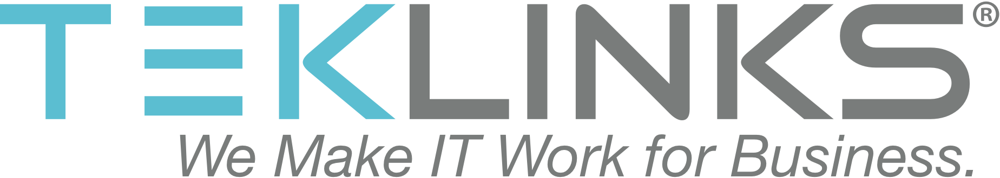
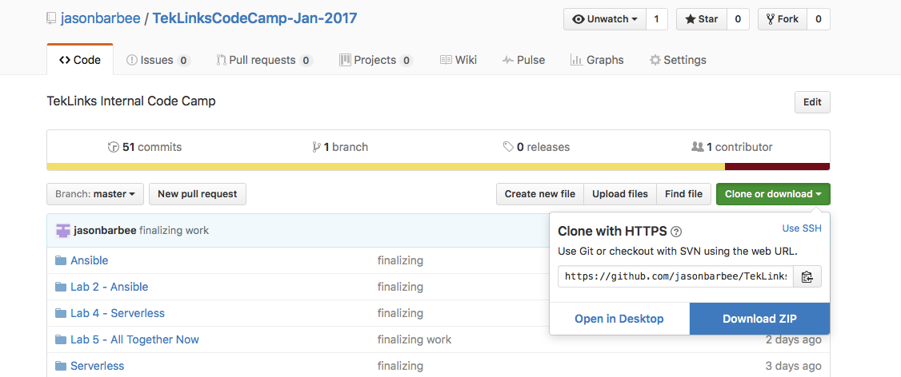

footer: TekLinks Code Camp
slidenumbers: true
autoscale: true


# Code Camp
## Environment Setup


Jason Barbee
Solutions Architect
CCIE #18039

---
Agenda
==

1. Install VirtualBox and Vagrant
1. Launch Vagrant Box
1. Install VS Code and Postman

---
# Download Code Repository
### https://github.com/jasonbarbee/TekLinksCodeCamp-Jan-2017 



---
# Next Next Next
* Download Vagrant and install - https://www.vagrantup.com/downloads.html
* Download Virtualbox and install https://www.virtualbox.org/wiki/Downloads
* Visual Studio Code https://code.visualstudio.com/download
* Postman https://www.getpostman.com

----
# Launch Code Camp Virtualbox Installer
* Unzip the Github Repo
* Open a shell and cd to the ```vagrant-code-camp``` folder
* Issue command ```vagrant up```. give it 10-20 minutes. 
* When done ```vagrant ssh``` to get inside the VM. 

---
# Vagrant Usage
```Vagrant up``` - boots up the VM
```Vagrant ssh``` - connects to your VM Shell
```Vagrant down``` - shutdown the virtualbox
```Vagrant destroy``` - removes the virtual machine

---
# Vagrant Shared folder
Vagrant maps a shared folder within the VM you can access.
Use /vagrant to access the "vagrant-code-camp" folder

---
# Setup VS Code ( Optional )
Install a few extensions
Within VS Code choose "View -> Extensions" or click the Extensions icon on the left tree.
Some recommendations
* vscode-icons - 
* ESLint or jshint (Linting Tool)
* Code Spellchecker
* beautify

---
# AWS Setup
Create a TekLinks AWS Account if you don't have one.
We will be using S3, API Gateway, Lambda, and CloudFormation.
It will be free if you are in the 1 year Free Tier. If not, most all the services are still free.
API Gateway is not in post 1 year free tier, but costs should be pennies.
It should be impossible to spend more than the cost cup of coffee these 2 days.

---
## 
==
## We will start Presentations at 9:30am.
==
## https://github.com/jasonbarbee/TekLinksCodeCamp-Jan-2017 
