footer: TekLinks Code Camp
slidenumbers: true
autoscale: true

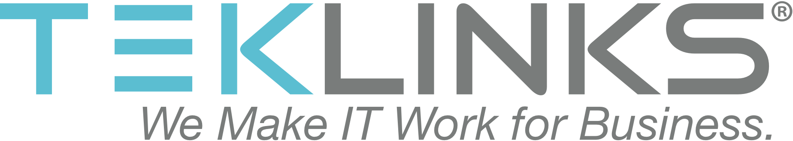
# Code Camp
## Serverless Platforms
 Jason Barbee
Solutions Architect
CCIE #18039

---
Agenda
==

1. Evolution of a Platform
1. Consumable Platforms today
1. Function as a Service
1. Lab Outline

---
# Compute in 2000's - Physical
Physical Server Farm

Provision Time - days


---
# Compute in 2010 - Virtualization 


VMWare Servers on physical hardware, SANs, Networking
Provision Time - ~ 1-2 hours

---
# Compute in ~2014 - Virtual Machines 
* Spin up VMs at your favorite provider - 
* TekLinks, AWS, Google, Azure, dozens of providers...

---
# Compute in 2017 - Microservices and APIs
* FAAS / Function as a Service Providers.
* AWS, Google, Azure, Webtasks
* Your customer's routers.
* Your customer's compute, or hyperconvered.

---
^ Cisco wants to have a world where your routers are just compute and storage resources, like AWS, you can push functions to.
^ Or just run small services on them, like IoT things gathering data from a local site and storing.
# Routers = Cloud
#### Routers can run third party service containers. AKA - your code
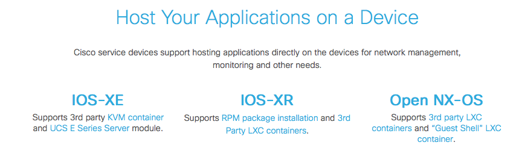

---
# Servers = Cloud 
## Azure wants to run on your bare metal. Same APIs as public cloud
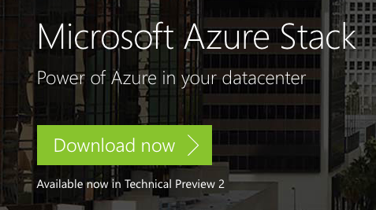

---
Agenda
==

1. Evolution of a Platform
1. **Consumable Platforms today**
1. Bot Revolution
1. Function as a Service
1. Lab Outline


---
# API Connector Services - IFTT
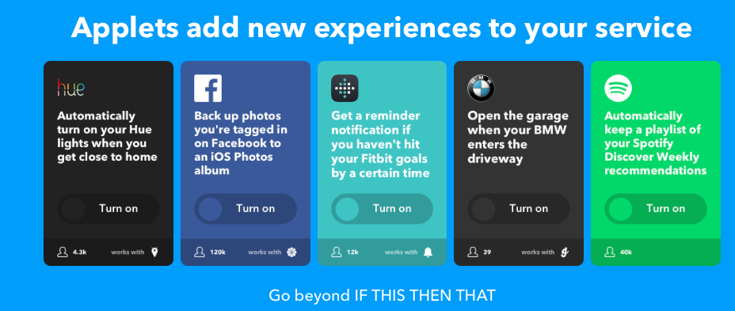

---
### IFTT - Custom REST Actions to anything

- Add custom actions with Maker Channel to any URL.
- Send a REST call to any endpoint on the internet.
- Make a Spark call, Tropo Call, Turn on/Off lights.

---
# Zapier.com - Business Logic 
* More logic and customization of actions.
* Still End User Friendly. Free and commercial plans.
* 750+ API integrations built in

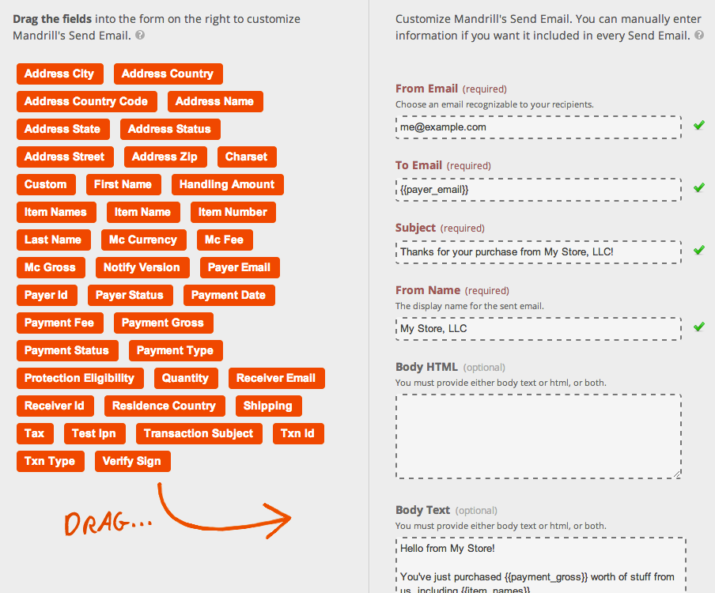

---
Agenda
==

1. Evolution of a Platform
1. Consumable Platforms today
1. **Bot Revolution**
1. Function as a Service
1. Lab Outline


---
# Why would I want a bot?
We all hate calling and navigating IVRs.
Bots are a new User Interface.

* /reboot serverfarm
* /forward 5555555555
* any interaction

---
# Bot Platforms

* Gupshup.com
* Recast.ai
* wit.ai
* Flint Framework for Node
* Microsoft Bot Framework
* Serverless Bots with URL Web Hooks and Actions

---
Agenda
==

1. Evolution of a Platform
1. Consumable Platforms today
1. Bot Revolution
1. **Function as a Service**
1. Lab Outline


---
# Function-As-A-Service
* Function as a Service to run small units of code on on requests or evenets
* Read or Write to a database.
* Call a Spark Log
* Call a payment processing and return a value.
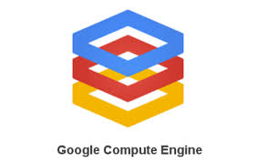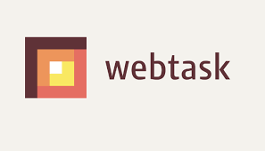
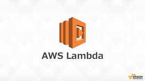 

---
# AWS Microservice Example
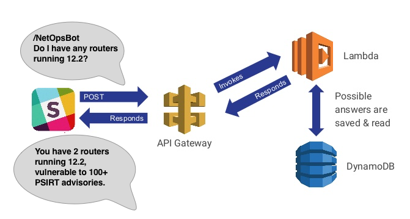

---
# AWS API Gateway 
* Accepts GET, POST, PUT all the REST APIs.
http://mynetopsbot.exampleamazon.com
{
    "Email": "jason.barbee@gmail.com",
    "Message": "do I have any routers running 12.2"
}


---
# AWS Components
Lambda

Our example : Lambda parses the language and intention, queries a database for security issues for 12.2.
Returns results to Lambda for processing.

---
# AWS Microservice Example
Lambda - adds language back to the message and sends to a Spark Web Hook.
http://spark.cisco.com
{
  "message" : "You have 2 routers running 12.2 vulnerable to 100+ PSIRT advisories"
  "roomID" : "1234123213125125234234"
}

---
# Storing Data

---
# DynamoDB -  NoSQL Database 

### Let's start with SQL and compare to NoSQL
```sql
INSERT INTO book (
  `ISBN`, `title`, `author`
)
VALUES (
  '9780992461256', 
  'Mastering Windows NT 4.0', 
  'John Smith'
);
```
---
# DynamoDB - NoSQL Example
```javascript
db.book.insert({
  ISBN: "9780992461256",
  title: "Full Stack JavaScript",
  author: "Colin Ihrig & Adam Bretz"
});
```

---
# AWS Microservice Example Review


--- 
# What does a real function look like?

---
# Hello World at hook.io
Hello World

```javascript
module['exports'] = function helloWorld (hook) {
  hook.res.end("Hello world!"');
};
```

---
# Hello world at Webtask.io
```javascript
module.exports = 
	function (cb) {
    	cb(null, 'Hello World');
    }
```

---
# Make a API Gateway example
Login to AWS Console
Go to API Gateway. Click Getting Started. You'll get the PetStore API.

---
# Example API Gateway
AWS API Gateway
Click Getting Started to import the example PetStore API.

---
# My PetStore API - GET 
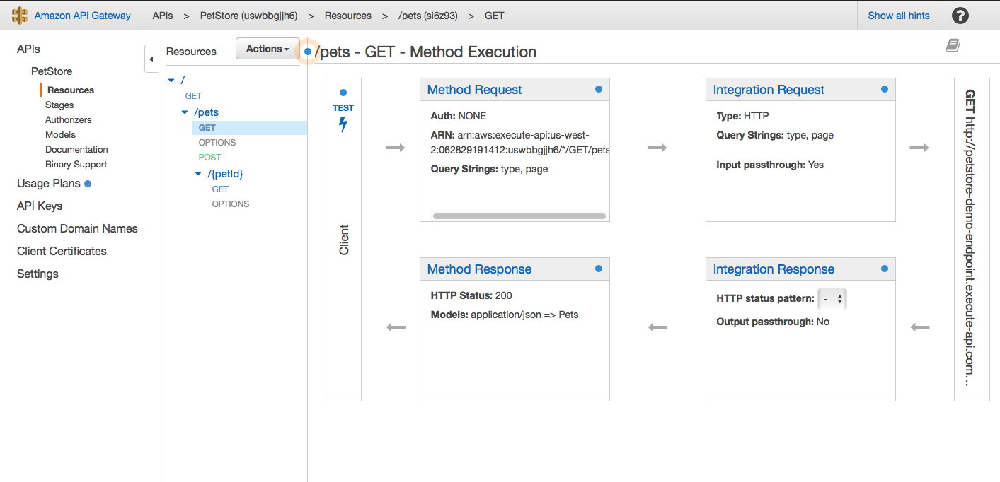

---
# PetStore GET - Response/Test


---
^ I know what you're thinking. It is.
# That looks too complicated
---
^ Let's see the easy way. With these commands a little credentials, we just deployed a Hello World API.
## Meet the Serverless Framework - www.serverless.com
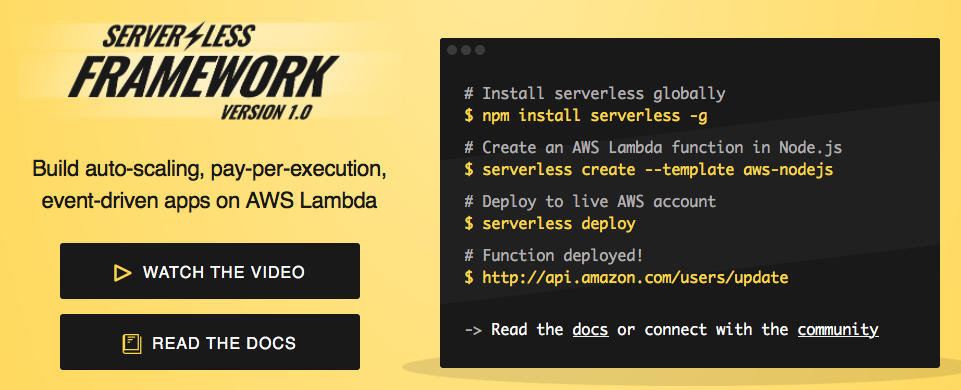

--- 
^ There's a lot of magic here.
# Serverless magic
* Cloudformation to build your environment - API, Lambda, Storage, Databases.
* API Versioning 
* Staging to Production


