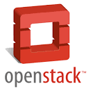

footer: TekLinks Code Camp
slidenumbers: true
autoscale: true


# Code Camp
## Serverless Platforms
 Jason Barbee
Solutions Architect
CCIE #18039

---
Agenda
==

1. Evolution of a Platform
1. Consumable Platforms today
1. Function as a Service
1. Lab Outline

---
# Compute in 2000's - Physical
Physical Server Farm

Provision Time - days


---
# Compute in 2010 - Virtualization 


VMWare Servers on physical hardware, SANs, Networking
Provision Time - ~ 1-2 hours

---
# Compute in ~2014 - Virtual Machines 
* Spin up VMs at your favorite provider - 
* TekLinks, AWS, Google, Azure, dozens of providers...

---
# Compute in 2017 - Microservices and APIs
* FAAS / Function as a Service Providers.
* AWS, Google, Azure, Webtasks
* Your customer's routers.
* Your customer's compute, or hyperconvered.

---
^ Cisco wants to have a world where your routers are just compute and storage resources, like AWS, you can push functions to.
^ Or just run small services on them, like IoT things gathering data from a local site and storing.
# Routers = Cloud
#### Routers can run third party service containers. AKA - your code


---
# Servers = Cloud 
## Azure wants to run on your bare metal. Same APIs as public cloud


---
# Servers = Cloud
## OpenStack wants to run on bare metal and provide APIs for compute, storage and networking.


---
Agenda
==

1. Evolution of a Platform
1. **Consumable Platforms today**
1. Bot Revolution
1. Function as a Service
1. Lab Outline


---
# API Connector Services - IFTT


---
### IFTT - Custom REST Actions to anything

- Add custom actions with Maker Channel to any URL.
- Send a REST call to any endpoint on the internet.
- Make a Spark call, Tropo Call, Turn on/Off lights.

---
# Zapier.com - Business Logic 
* More logic and customization of actions.
* Still End User Friendly. Free and commercial plans.
* 750+ API integrations built in


---
Agenda
==

1. Evolution of a Platform
1. Consumable Platforms today
1. **Bot Revolution**
1. Function as a Service
1. Lab Outline


---
# Bots the new User interface
Why would I want to talk to a bot?
We all hate calling and navigating IVRs.

---
# Bot Platforms

* Gupshup.com
* Recast.ai
* wit.ai
* Flint Framework for Node
* Microsoft Bot Framework
* Serverless Bots with URL Web Hooks and Actions

---
Agenda
==

1. Evolution of a Platform
1. Consumable Platforms today
1. Bot Revolution
1. **Function as a Service**
1. Lab Outline


---
# Function-As-A-Service
* Function as a Service to run small units of code on on requests or evenets
* Read or Write to a database.
* Call a Spark Log
* Call a payment processing and return a value.

 

---
# AWS Microservice Example


---
# AWS API Gateway 
* Accepts GET, POST, PUT all the REST APIs.
http://mynetopsbot.exampleamazon.com
{
    "Email": "jason.barbee@gmail.com",
    "Message": "do I have any routers running 12.2"
}


---
# AWS Components
Lambda

Our example : Lambda parses the language and intention, queries a database for security issues for 12.2.
Returns results to Lambda for processing.

---
# AWS Microservice Example
Lambda - adds language back to the message and sends to a Spark Web Hook.
http://spark.cisco.com
{
  "message" : "You have 2 routers running 12.2 vulnerable to 100+ PSIRT advisories"
  "roomID" : "1234123213125125234234"
}

---
# Storing Data

---
# DynamoDB -  NoSQL Database 

### Let's start with SQL and compare to NoSQL
```sql
INSERT INTO book (
  `ISBN`, `title`, `author`
)
VALUES (
  '9780992461256', 
  'Mastering Windows NT 4.0', 
  'John Smith'
);
```
---
# DynamoDB - NoSQL Example
```javascript
db.book.insert({
  ISBN: "9780992461256",
  title: "Full Stack JavaScript",
  author: "Colin Ihrig & Adam Bretz"
});
```

---
# AWS Microservice Example Review


--- 
# What does a microservice function look like?

---
# Hello World at hook.io
Hello World

```javascript
module['exports'] = function helloWorld (hook) {
  hook.res.end("Hello world!"');
};
```

---
# Make a API Gateway example
Login to AWS Console
Go to API Gateway. Click Getting Started. You'll get the default PetStore API.

---
# Example API Gateway
AWS API Gateway
Click Getting Started to import the example PetStore API.

---
# My PetStore API - GET 


---
# PetStore GET - Response/Test


---
# Ok this isn't Fair
I used the template, and PetStoreAPI doesn't actally do anything.

---
# AWS API Gateway
You have to define all the endpoints one by one
create functions, link them to the API one by one
upload files and NPM packages to S3 if you want any imports
Stage dev and production if you want to have a backup copy hot and ready
Basically there's a lot of stuff to wire together, and a lot of clicks.


---
^ Let's see the easy way. With these commands a little credentials, we just deployed a Hello World API.
## Meet the Serverless Framework - www.serverless.com


--- 
^ There's a lot of magic here.
# Serverless magic
* Cloudformation to build your environment - API, Lambda, Storage, Databases.
* API Versioning 
* Staging to Production

--- 
# Example of Serverless Deployment

```bash
vagrant@vagrant:/vagrant/Serverless$ serverless config credentials --provider aws --key mykey --secret mysecret
Serverless: Setting up AWS...
Serverless: Saving your AWS profile in "~/.aws/credentials"...
Serverless: Success! Your AWS access keys were stored under the "default" profile.
vagrant@vagrant:/vagrant/Serverless$ serverless deploy
Serverless: Packaging service...
Serverless: Uploading CloudFormation file to S3...
Serverless: Uploading service .zip file to S3 (3.6 MB)...
Serverless: Updating Stack...
Serverless: Checking Stack update progress...
......................................
Serverless: Stack update finished...
Service Information
service: serverless-rest-api-with-dynamodb
stage: dev
region: us-east-1
api keys:
  None
endpoints:
  POST - https://3snrpqj7tj.execute-api.us-east-1.amazonaws.com/dev/routers
  GET - https://3snrpqj7tj.execute-api.us-east-1.amazonaws.com/dev/routers
  GET - https://3snrpqj7tj.execute-api.us-east-1.amazonaws.com/dev/routers/{id}
  PUT - https://3snrpqj7tj.execute-api.us-east-1.amazonaws.com/dev/routers/{id}
  DELETE - https://3snrpqj7tj.execute-api.us-east-1.amazonaws.com/dev/routers/{id}
functions:
  serverless-rest-api-with-dynamodb-dev-update: arn:aws:lambda:us-east-1:062829191412:function:serverless-rest-api-with-dynamodb-dev-update
  serverless-rest-api-with-dynamodb-dev-get: arn:aws:lambda:us-east-1:062829191412:function:serverless-rest-api-with-dynamodb-dev-get
  serverless-rest-api-with-dynamodb-dev-list: arn:aws:lambda:us-east-1:062829191412:function:serverless-rest-api-with-dynamodb-dev-list
  serverless-rest-api-with-dynamodb-dev-create: arn:aws:lambda:us-east-1:062829191412:function:serverless-rest-api-with-dynamodb-dev-create
  serverless-rest-api-with-dynamodb-dev-delete: arn:aws:lambda:us-east-1:062829191412:function:serverless-rest-api-with-dynamodb-dev-delete
vagrant@vagrant:/vagrant/Serverless$
```

---
# Lab 4 - Going Serverless
You will get to build/deploy/play with
* Hook.io Microservice that logs to a Spark Room.
* AWS REST API that actually interfaces with a DynamoDB.
* Using Ansible to push inventory data into that AWS REST API.

---
# Wrapping up
* No we don't all have to write code tomorrow.
* There's never been a more exciting time in our field. 
* Engineers are building cool stuff and sharing it.
* Open source is better than ever, and has a lot of corporate backing.

---
# Call to Action:

Actively seek opportunities and Engage us (myself and Jeremy Sanders) to

* Tie collaboration or workflow platforms together
* Add human like interactions to common tasks via chat bots
* Write small apps that integrate business processes together
* Help you deploy and learn Ansible.
* Write scripting to be more efficient on projects if you find yourself facing a large repetitive task set or a chain of processes.

---
<br>
# Thank you.
<br>
# Questions?
