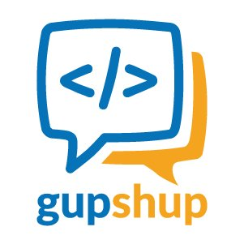

Code Camp
==

<!-- footer: TekLinks Code Camp - Jan 2017 -->

<!-- *page_number: true -->

## Serverless Platforms
 Jason Barbee
Solutions Architect
CCIE #18039

---
Goals
==

1. Evolution of a Platform
1. Consumable Platforms today
1. Function as a Service
1. Lab Outline

---
# Compute in 2000's - Physical
Physical Server Farm

Provision Time - days

---
# Compute in 2010 - Virtualization 

VMWare Servers on physical hardware, SANs, Networking
Provision Time - hour(s) 
*if we had SAN space and the hardware

---
# Compute in 2017 - Microservices
## FAAS / Function as a Service Providers.
AWS, Google, Azure, Webtasks
## API Integration Providers
IFTT, Zapier

---
# IFTT.com - Simple Tasks

## Simple Action "Recipes"
 
### Free. 
### Add custom actions with Maker Channel to any URL.

---
# Zapier.com
## More logic and customization of actions.
## Still End User Friendly. Free plan and up.
# 750+ API integrations
    

---
# Bot Builders

* Gupshup.com
* Recast.ai
* wit.ai
* Flint Framework for Node
* Microsoft Bot Framework
## Serverless Bots with URL Web Hooks and Actions

---
# Microservices / Function-As-A-Service
 
 

Example Pricing
AWS Lambda -1 million executions free.
$0.000000208 per 100ms of compute time.

Webtasks.io - Free/1 per second...
hook.io - Free / 1000 requests per month

---
# AWS Microservice Detail

--- 
# Lab - Hook.io
Create account at www.hook.io

---
# Create Hook.io MicroService

Code 
github...

